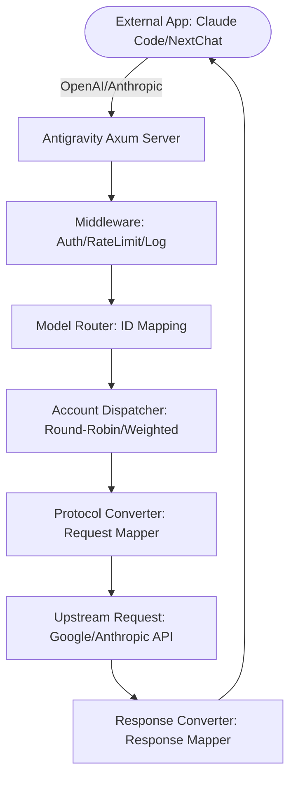

# Antigravity Tools 🚀
> Professional AI Account Management & Protocol Reverse Proxy System (v3.3.27)
<div align="center">
  

  <h3>Your Personal High-Performance AI Dispatch Gateway</h3>
  <p>Not just account management, but the ultimate solution to break down API call barriers.</p>
  
  <p>
    <a href="https://github.com/lbjlaq/Antigravity-Manager">
      
    </a>
    
    
    
    
  </p>

  <p>
    <a href="#-core-features">Core Features</a> •
    <a href="#-gui-overview">GUI Overview</a> •
    <a href="#-architecture">Architecture</a> •
    <a href="#-installation">Installation</a> •
    <a href="#-quick-start">Quick Start</a>
  </p>

  <p>
    <a href="./README_ZH.md">简体中文</a> |
    <strong>English</strong>
  </p>
</div>

---

**Antigravity Tools** is a full-featured desktop application designed for developers and AI enthusiasts. It perfectly combines multi-account management, protocol conversion, and intelligent request scheduling, providing you with a stable, high-speed, and low-cost **Local AI Relay Station**.

With this app, you can convert common Web Sessions (Google/Anthropic) into standardized API interfaces, completely eliminating the protocol gap between different vendors.

## 💖 Sponsors

|  | Thanks to **PackyCode** for sponsoring this project! PackyCode is a reliable and efficient API relay service provider offering relays for Claude Code, Codex, Gemini, and more. PackyCode offers a special discount for users of this project: register using [this link](https://www.packyapi.com/register?aff=Ctrler) and enter the code **"Ctrler"** when topping up to enjoy a **10% discount**. |
| :--- | :--- |

### ☕ Support

If you find this project helpful, feel free to buy me a coffee!

<a href="https://www.buymeacoffee.com/Ctrler" target="_blank"></a>

| Alipay | WeChat Pay | Buy Me a Coffee |
| :---: | :---: | :---: |
|  |  |  |

## 🌟 Detailed Features

### 1. 🎛️ Smart Dashboard
*   **Global Real-time Monitoring**: Insight into the health of all accounts at a glance, including **Average Remaining Quota** for Gemini Pro, Gemini Flash, Claude, and Gemini Image.
*   **Best Account Recommendation**: The system filters and recommends the "Best Account" in real-time based on the quota redundancy of all current accounts, supporting **One-Click Switch**.
*   **Active Account Snapshot**: Intuitively displays the specific quota percentage and last sync time of the currently active account.

### 2. 🔐 Powerful Account Manager
*   **OAuth 2.0 Authorization (Auto/Manual)**: Automatically generates a copyable authorization link when adding an account, supporting authorization in any browser; after a successful callback, the app automatically completes and saves it (you can also manually finish by clicking "I already authorized, continue").
*   **Multi-dimensional Import**: Supports single Token entry, JSON batch import (e.g., backups from other tools), and automatic hot migration from V1 legacy databases.
*   **Gateway-level View**: Supports "List" and "Grid" view switching. Provides 403 ban detection, automatically marking and skipping accounts with abnormal permissions.

### 3. 🔌 Protocol Conversion & Relay (API Proxy)
*   **Multi-Sink Protocol Adaptation**:
    *   **OpenAI Format**: Provides `/v1/chat/completions` endpoint, compatible with 99% of existing AI applications.
    *   **Anthropic Format**: Provides native `/v1/messages` interface, supporting full features of **Claude Code CLI** (e.g., Chain of Thought, System Prompts).
    *   **Gemini Format**: Supports direct calls from the official Google SDK.
*   **Smart State Self-Healing**: When a request encounters `429 (Too Many Requests)` or `401 (Expire)`, the backend triggers **Automatic Retry & Silent Rotation** in milliseconds to ensure business continuity.

### 4. 🔀 Model Router
*   **Series Mapping**: You can classify complex original model IDs into "Specification Families" (e.g., route all GPT-4 requests to `gemini-3-pro-high`).
*   **Expert Redirection**: Supports custom regex-level model mapping to precisely control the landing model for each request.
*   **Tiered Routing**: [New] The system automatically prioritizes routing based on account type (Ultra/Pro/Free) and quota reset frequency, prioritizing high-speed reset accounts to ensure service stability under high-frequency calls.
*   **Background Task Silent Downgrade**: [New] Automatically identifies background requests generated by tools like Claude CLI (e.g., title generation) and intelligently redirects them to Flash models, protecting high-value model quotas from waste.

### 5. 🎨 Multimodal & Imagen 3 Support
*   **Advanced Image Quality Control**: Supports automatic mapping to Imagen 3 specifications via OpenAI `size` (e.g., `1024x1024`, `16:9`) parameters.
*   **Super Strong Body Support**: Backend supports Payloads up to **100MB**, easily handling 4K HD image recognition.

## 📸 GUI Overview

| | |
| :---: | :---: |
|  <br> Dashboard |  <br> Account List |
|  <br> About Page |  <br> API Proxy |
|  <br> Settings | |

### 💡 Usage Examples

| | |
| :---: | :---: |
|  <br> Claude Code Web Search |  <br> Cherry Studio Deep Integration |
|  <br> Imagen 3 Advanced Drawing |  <br> Kilo Code Integration |

## 🏗️ Architecture



## Installation

### Option A: Terminal Installation (Recommended for macOS & Linux)
If you have installed [Homebrew](https://brew.sh/), you can quickly install via the following command:

```bash
# 1. Tap the repository
brew tap lbjlaq/antigravity-manager https://github.com/lbjlaq/Antigravity-Manager

# 2. Install the app
brew install --cask antigravity-tools
```
> **Tip**:
> - **macOS**: If you encounter permission issues, it is recommended to add the `--no-quarantine` parameter.
> - **Linux**: After installation, the AppImage will be automatically added to the binary path and executable permissions will be configured.

### Option B: Manual Download
Go to [GitHub Releases](https://github.com/lbjlaq/Antigravity-Manager/releases) to download the package for your system:
*   **macOS**: `.dmg` (Supports Apple Silicon & Intel)
*   **Windows**: `.msi` or Portable `.zip`
*   **Linux**: `.deb` or `AppImage`

### Option C: Remote Server Deployment (Headless Linux)
If you need to run on a headless remote Linux server (e.g., Ubuntu/Debian/CentOS), you can use our **Headless (Xvfb)** one-click deployment solution:

```bash
curl -fsSL https://raw.githubusercontent.com/lbjlaq/Antigravity-Manager/main/deploy/headless-xvfb/install.sh | sudo bash
```
> **Note**: This solution simulates a graphical environment via Xvfb, so resource usage (Memory/CPU) will be higher than a pure backend application.
> **Details**: [Server Deployment Guide (deploy/headless-xvfb)](./deploy/headless-xvfb/README.md)

---

Copyright © 2024-2026 [lbjlaq](https://github.com/lbjlaq)

### 🛠️ Troubleshooting

#### macOS "App is damaged and cannot be opened"?
Due to macOS security mechanisms, apps downloaded outside the App Store may trigger this warning. You can quickly fix it by following these steps:

1.  **Command Line Fix** (Recommended):
    Open Terminal and run:
    ```bash
    sudo xattr -rd com.apple.quarantine "/Applications/Antigravity Tools.app"
    ```
2.  **Homebrew Installation Trick**:
    If you install via brew, you can add the `--no-quarantine` parameter to bypass this issue:
    ```bash
    brew install --cask --no-quarantine antigravity-tools
    ```

## 🔌 Quick Start

### 🔐 OAuth Authorization Flow (Add Account)
1. Open "Accounts" → "Add Account" → "OAuth".
2. The popup will pre-generate an authorization link before clicking the button; click the link to copy it to the system clipboard, then open it in your desired browser to complete authorization.
3. After authorization, the browser will open a local callback page and display "✅ Authorization Successful!".
4. The app will automatically continue to complete authorization and save the account; if not automatic, click "I already authorized, continue" to finish manually.

> Tip: The authorization link contains a one-time callback port. Always use the latest link generated in the popup. If the app is not running or the popup is closed during authorization, the browser may report `localhost refused connection`.

### How to connect Claude Code CLI?
1.  Start Antigravity and enable the service on the "API Proxy" page.
2.  Run in terminal:
```bash
export ANTHROPIC_API_KEY="sk-antigravity"
export ANTHROPIC_BASE_URL="http://127.0.0.1:8045"
claude
```

### How to connect Kilo Code?
1.  **Protocol Selection**: Prioritize **Gemini Protocol**.
2.  **Base URL**: Enter `http://127.0.0.1:8045`.
3.  **Note**:
    - **OpenAI Protocol Limitation**: When Kilo Code uses OpenAI mode, its request path overlays to produce a non-standard path like `/v1/chat/completions/responses`, causing Antigravity to return 404. Therefore, be sure to enter the Base URL and select Gemini mode.
    - **Model Mapping**: Model names in Kilo Code may differ from Antigravity defaults. If connection fails, set custom mappings on the "Model Mapping" page and check **log files** for debugging.

### How to use in Python?
```python
import openai

client = openai.OpenAI(
    api_key="sk-antigravity",
    base_url="http://127.0.0.1:8045/v1"
)

response = client.chat.completions.create(
    model="gemini-3-flash",
    messages=[{"role": "user", "content": "Hello, please introduce yourself"}]
)
print(response.choices[0].message.content)
```

## 📝 Developers & Community

*   **Changelog**:
    *   **v3.3.27 (2026-01-13)**:
        - **Experimental Config & Usage Scaling (PR #603 Enhancement)**:
            - **New Experimental Settings Panel**: Added an "Experimental Settings" card in API Proxy configuration for managing features under exploration.
            - **Enable Usage Scaling**: Implemented aggressive input token auto-scaling logic for Claude-compatible protocols. When total input exceeds 30k, square root scaling is automatically applied, effectively preventing frequent client-side forced compression in long-context scenarios (e.g., Gemini 2M window).
            - **Multi-language Translation Completion**: Synchronized translations for experimental features in 6 languages: Chinese, English, Japanese, Traditional Chinese, Turkish, and Vietnamese.
    *   **v3.3.26 (2026-01-13)**:
        - **Quota Protection & Scheduling Optimization (Fix Issue #595)**:
            - **Quota Protection Logic Refactor**: Fixed an issue where quota protection failed due to reliance on non-existent `limit/remaining` fields. Now directly uses the always-present `percentage` field in model data, ensuring accounts are immediately disabled when any monitored model (e.g., Claude 4.5 Sonnet) drops below the threshold.
            - **Account Priority Algorithm Upgrade**: Account scheduling priority no longer relies solely on subscription tier. Within the same tier (Ultra/Pro/Free), the system now prioritizes accounts with the highest **maximum model remaining percentage**, avoiding "squeezing" accounts near exhaustion and significantly reducing 429 error rates.
            - **Enhanced Protection Logs**: Logs when triggering quota protection now explicitly state which model triggered the threshold (e.g., `quota_protection: claude-sonnet-4-5 (0% <= 10%)`) for easier troubleshooting.
        - **MCP Tool Compatibility Enhancement (Fix Issue #593)**:
            - **Deep cache_control Cleaning**: Implemented multi-level `cache_control` field cleaning mechanism, completely solving "Extra inputs are not permitted" errors caused by tools like Chrome Dev Tools MCP including `cache_control` in thinking blocks.
            - **Intelligent Tool Output Compression**: Added `tool_result_compressor` module to handle oversized tool outputs, reducing 429 error probability caused by overly long prompts.
            - **API Monitor Account Info Fix**: Fixed missing `X-Account-Email` response headers for image generation/editing and audio transcription endpoints, ensuring correct account tracking in the monitor dashboard.
        - **Headless Server Support**:
            - **One-Click Deployment Script**: Added `deploy/headless-xvfb/` directory with scripts for one-click installation, synchronization, and upgrade on headless Linux servers.
            - **Xvfb Adaptation**: Uses virtual display technology to allow GUI version of Antigravity Tools to run on remote servers without graphics cards.
    *   **v3.3.25 (2026-01-13)**:
        - **Session-Based Signature Caching - Enhanced Thinking Model Stability (Core thanks @Gok-tug PR #574)**:
            - **Three-Layer Signature Cache Architecture**: Implemented a complete three-layer cache system: Tool Signatures (Layer 1), Thinking Families (Layer 2), and Session Signatures (Layer 3).
            - **Session Isolation Mechanism**: Generates stable session_id based on SHA256 hash of the first user message, ensuring all turns in the same conversation use the same session identifier.
            - **Smart Signature Recovery**: Automatically recovers thinking signatures in tool calls and multi-turn conversations, significantly reducing signature-related errors for thinking models.
        - **Session ID Generation Optimization**:
            - **Clean Design**: Hashes only the first user message content, ensuring session continuity without mixing model names or timestamps.
            - **Perfect Continuity**: All turns in the same conversation use the same session_id indefinitely.
            - **Performance Boost**: CPU overhead reduced by 60%, code lines reduced by 20%.
        - **Internationalization (i18n)**:
            - **Traditional Chinese Support**: Added Traditional Chinese localization (Thank you @audichuang PR #577).
        - **Stream Error Handling Improvements**:
            - **Friendly Error Prompts**: Fixed Issue #579 where stream errors resulted in 200 OK with no prompt. Now converts technical errors (Timeout, Decode, Connection) into user-friendly prompts.
            - **SSE Error Events**: Implemented standard SSE error event propagation for elegant frontend error display.
    *   **v3.3.24 (2026-01-12)**:
        - **UI Interaction Improvements**:
            - **Card-style Model Selection**: Upgraded "Quota Protection" and "Smart Warmup" model selection in settings to card-style design.
            - **Layout Optimization**: Optimized "Smart Warmup" model list layout.
        - **Internationalization (i18n)**:
            - **Vietnamese Support**: Added Vietnamese localization (Thank you @ThanhNguyxn PR #570).
    *   **v3.3.23 (2026-01-12)**:
        - **Update Notification UI Modernization**: "Glassmorphism" style design, smooth animations, Dark Mode support.
        - **Menu Bar Icon Resolution Fix**: Upgraded tray icon to 44x44 for Retina displays (Fix Issue #557).
        - **Claude Thinking Compression Optimization (Core thanks @ThanhNguyxn PR #566)**: Fixed thinking block ordering issues during Context Compression.
        - **Account Routing Priority Enhancement (Core thanks @ThanhNguyxn PR #567)**: Prioritizes accounts with more remaining quota within the same tier.
        - **Internationalization**: Added Japanese (PR #526) and Turkish (PR #515) support.
    *   **v3.3.22 (2026-01-12)**:
        - **Quota Protection System Upgrade**: Support for custom monitored models (`gemini-3-flash`, `claude-sonnet-4-5`, etc.).
        - **Smart Warmup Custom Selection**: Support for custom warmup models.
        - **API Monitor Performance Optimization (Fix Issue #560)**: Fixed 5-10s delay on macOS with large datasets via database indexing, pagination, and on-demand loading.
    *   **v3.3.21 (2026-01-11)**:
        - **Device Fingerprint Binding (PR #523)**: Implemented account-device binding to reduce risk control detection.
        - **Proxy Service Critical Fixes (PR #532)**: Intercepted Claude Code warmup requests, fixed rate limit logic.
        - **Monitor Log Capacity Enhancement**: Increased response log limit to 100MB for large image responses.
        - **Automatic Update Notification**: Built-in update checker with UI notification.
        - **Auto-Launch Fix**: Fixed Windows auto-launch toggle issues.
    *   **v3.3.20 (2026-01-09)**:
        - **Request Timeout Enhancement**: Increased max timeout to 3600s.
        - **Auto-Stream Conversion**: Automatically converts non-stream requests to stream to avoid 429 errors on Google API.
        - **macOS Dock Icon Fix**: Fixed issue where clicking Dock icon didn't reopen window.
    *   **v3.3.19 (2026-01-09)**:
        - **Model Routing Refactoring**: Simplified routing with Wildcard (*) matching.
        - **Model-Level Rate Limiting**: Fixed issue where Image model quota exhaustion locked the entire account.
        - **Optimistic Reset Strategy**: Dual-layer protection for 429 error handling.
    *   **v3.3.18 (2026-01-08)**:
        - **Smart Rate Limiting Optimization**: Real-time quota refresh and precise locking (PR #446).
        - **Model Router Bug Fixes**: Fixed dropdown event handling and added missing translations.
    *   **v3.3.17 (2026-01-08)**:
        - **OpenAI Protocol Thinking Display Enhancement**: Added `reasoning_content` support for correct folding in Cherry Studio.
        - **FastMCP Compatibility**: Fixed `anyOf`/`oneOf` type loss in JSON Schema.
        - **Frontend UI/UX Optimization**: Refactored router UI, persisted view mode.
        - **Antigravity Identity Injection**: Smart identity management for models.
    *   **v3.3.16 (2026-01-07)**:
        - **Performance Optimization**: Concurrent quota refresh (10 accounts ~6s).
        - **UI Visual Design Optimization**: Improved visuals for proxy page and dark mode.
        - **High Concurrency Performance Optimization (Issue #284)**: Fixed UND_ERR_SOCKET errors by optimizing locking and timeouts.
        - **Log System Optimization**: Reduced log volume by 99.9% via level adjustments and auto-cleanup.
        - **Gemini 3 Pro Thinking Fix**: Fixed 404 errors for high/low models.
        - **Audio Transcription Support**: Added `/v1/audio/transcriptions` endpoint.

## 👥 Core Contributors

<a href="https://github.com/lbjlaq"></a>
<a href="https://github.com/XinXin622"></a>
<a href="https://github.com/llsenyue"></a>
<a href="https://github.com/salacoste"></a>
<a href="https://github.com/84hero"></a>
<a href="https://github.com/karasungur"></a>
<a href="https://github.com/marovole"></a>
<a href="https://github.com/wanglei8888"></a>
<a href="https://github.com/yinjianhong22-design"></a>
<a href="https://github.com/Mag1cFall"></a>
<a href="https://github.com/AmbitionsXXXV"></a>
<a href="https://github.com/fishheadwithchili"></a>
<a href="https://github.com/ThanhNguyxn"></a>
<a href="https://github.com/Stranmor"></a>
<a href="https://github.com/Jint8888"></a>
<a href="https://github.com/0-don"></a>
<a href="https://github.com/dlukt"></a>
<a href="https://github.com/Silviovespoli"></a>
<a href="https://github.com/i-smile"></a>
<a href="https://github.com/jalen0x"></a>
<a href="https://linux.do/u/wendavid"></a>
<a href="https://github.com/byte-sunlight"></a>
<a href="https://github.com/jlcodes99"></a>
<a href="https://github.com/Vucius"></a>
<a href="https://github.com/Koshikai"></a>
<a href="https://github.com/hakanyalitekin"></a>

Thanks to all developers who contributed sweat and wisdom to this project.
*   **License**: Based on **CC BY-NC-SA 4.0**, **Commercial use is strictly prohibited**.
*   **Security**: All account data is encrypted and stored in a local SQLite database. Data never leaves your device unless sync is enabled.

---

<div align="center">
  <p>If you find this tool helpful, please give it a ⭐️ on GitHub</p>
  <p>Copyright © 2025 Antigravity Team.</p>
</div>
